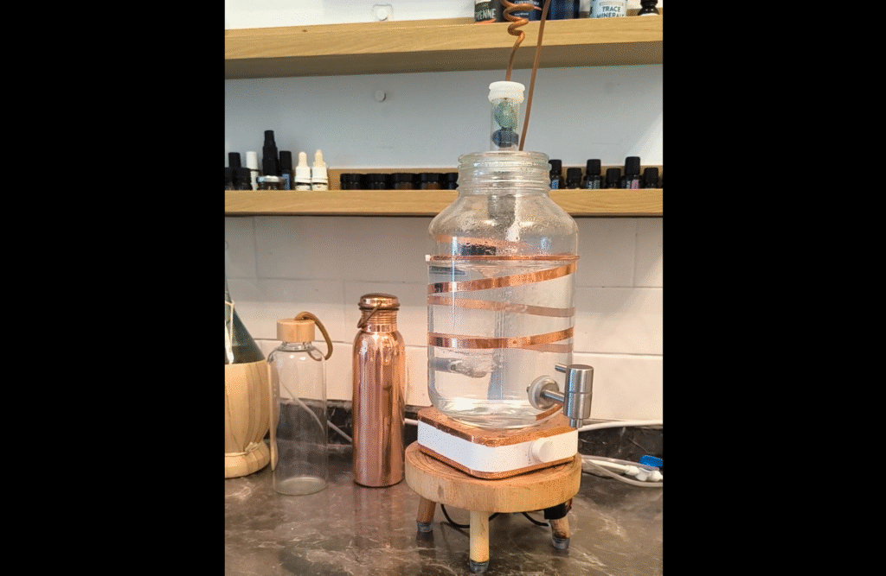

# איך לייצר וורטקס במים - בקלות ובבית

תנועת וורטקס (מערבולת לוליינית) משפיעה על איכות המים במגוון דרכים:  
היא מסייעת **לשחרר גזים מזיקים** כמו מתאן וראדון (שעלולים להימצא במי ברז בישראל),  
תורמת ל**ספיחת חמצן מהאוויר** — שכמעט ואינו קיים במי השתייה —  
ולפי השערות, החמצן הזה יכול לשפר את תפקוד מערכת העיכול.  
בנוסף, היא **משנה את המבנה המולקולרי של המים** — ויש מי שיראו בכך החזרת חיוניות.

📘 כתבתי על כך בהרחבה כאן:  
🔗 <https://thedigitalreality.net/why-vortexing-water/>  

רוצים להתנסות בזה בעצמכם? הנה שני מוצרים פשוטים ואפקטיביים:

🌀 **מערבל מגנטי** – משטח חשמלי מגנטי שמערבל את המים ויוצר תנועת וורטקס סיבובית  
🔗 <https://s.click.aliexpress.com/e/_oC1zMkO>

🌀 **כד מזיגה מותאם לוורטקס** – נבחר בקפידה מתוך עשרות דגמים, מתאים בגובה, בצורה ובעובי  
🔗 <https://s.click.aliexpress.com/e/_oBGLsSG>

🎥 **כך זה נראה בפועל:**

<figure class="wp-block-embed is-type-video is-provider-youtube wp-block-embed-youtube wp-embed-aspect-16-9 wp-has-aspect-ratio">

https://youtube.com/shorts/N04vjvc08wg?feature=share

</figure>

🧠 **דגשים חשובים:**

1.  לא כל כד מתאים — יש חשיבות אמיתית למבנה הכלי (גודל, צורה, עובי הזכוכית, וגם מבנה כללי). זה כד שהוכיח את עצמו אחרי עשרות ניסיונות.
2.  הקישורים הם קישורי שותפים. אם תרכשו דרך אחד מהם, אקבל עמלה קטנה (ללא שינוי במחיר עבורכם).

⚙️ ולמי שמתעניים ברעיון **יותר רציני, אוטומטי ומלא**,  
שכולל גם **סינון אופטימלי**, **מערכת וורטקס קבועה**, והתמלאות אוטומטית של הכד –  
יש אפשרות לבנות מערכת ביתית שלמה.

📦 **קורס בניית מערכת ימה** מלמד את כל התהליך —  
מהסינון, הציוד, החיבורים, ההרכבה, ועד יצירת וורטקס שעובד 24/7 ומתמלא לבד.

🔗 <https://thedigitalreality.net/courses/building-yama/>

<figure class="wp-block-image size-large">

</figure>

------------------------------------------------------------------------
