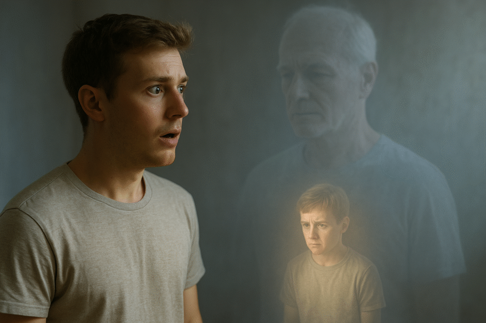

# תורת המראות

<figure class="wp-block-image size-large">

</figure>

**מראות** - אחד מהכלים הכי מעשיים ועוצמתיים שמצאתי להתפתחות אישית, 

מתוך עשרות אם לא מאות כלים שהתנסיתי בהם עד היום. 

**העוצמה של הכלי הזה כל כך גדולה, **

שאני מאמין שיש ביכולתו לסלול לאדם את הדרך אל השקט שלו - גם רק באמצעותו. 

המראה תשקף לך בצורה מדויקת ועמוקה 

**- רק אם תסכים - **

ותאפשר לך לראות את ההדחקות והפחדים הכי גדולים, 

אלו שדחפת עמוק עמוק ברבדים הנמוכים של תת־המודע. 

רגע התובנה הזה הוא עצום, עוצמתי ומשחרר עד כדי כך, 

שהאינסטינקט הראשוני הוא להלקות את עצמך על כמה היית עיוור - 

שלא ראית את מה שהיה מתחת לאף שלך כל הזמן. 

כשאתה מתחיל להפנים וליישם את תורת המראות בחיים, אתה מביט סביבך: 

על האנשים - כולם. 

משפחה, חברים, עמיתים בעבודה או בלימודים. 

ופתאום אתה רואה אחדות עצומה, כמו אורגניזם אחד שמורכב מהאנושות כולה. 

**כולם רק עוזרים ומראים לך מה אתה משליך החוצה** - ורק מבקשים ממך להסתכל פנימה. 

**ההסכמה לקבל את המראה משחררת לחופשי. **

יש לה יכולת לשחרר כל אתגר רגשי מול אנשים - כל קושי, פחד, כעס, תסכול או חוסר אונים. 

הכל מתפוגג ברגע שאתה מוכן להסתכל על המראה בעיניים, 

ולראות שהיא רק משקפת לך את מה שהדחקת מזמן - 

את מה שיושב בתת־המודע, מייצר עודף מחשבות, לחץ, סטרס, מקשה לישון, לעבוד ולהתמקד. 

כבר קרוב לשבע שנים שאני מתרגל את תורת המראות. וכמו שריר שמתחזק, 

אני לומד עוד ועוד לראות את עצמי דרך אותן מראות, 

ולגלות שמאחורי מי שחשבתי שאני - נמצא מי שאני באמת.
