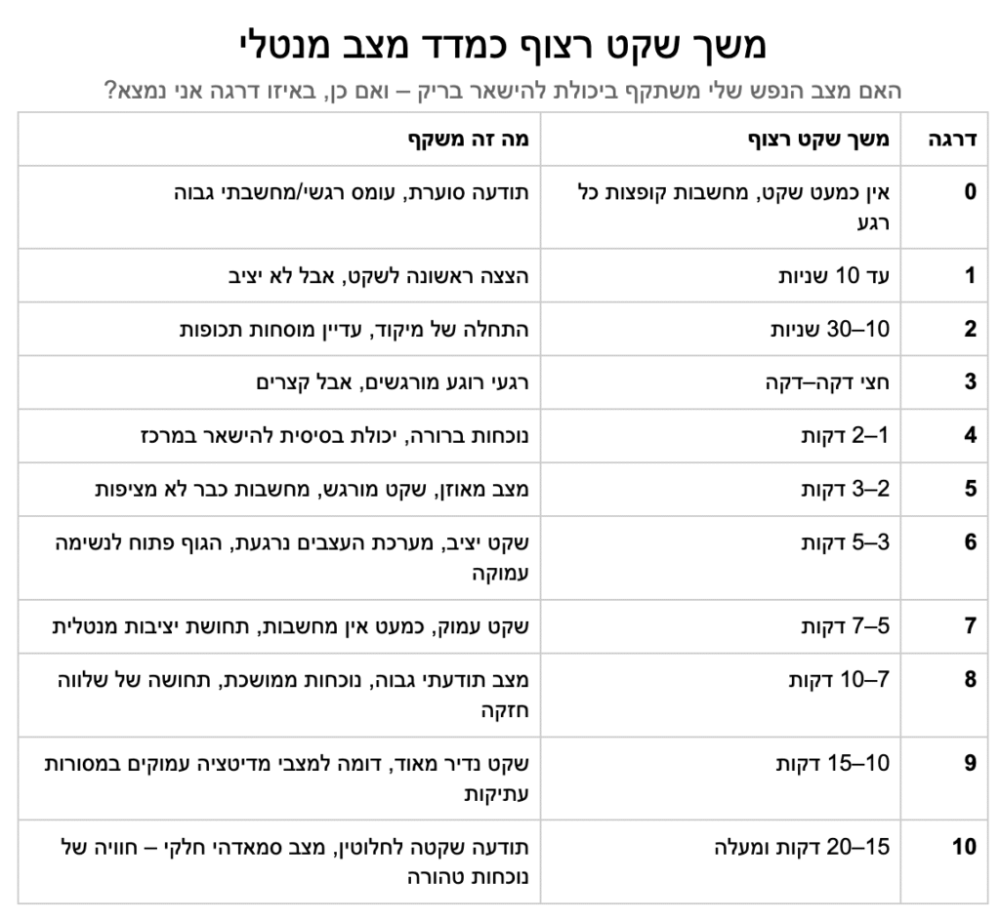

# השקט הפנימי – האם הוא ניתן להשגה?

<figure class="wp-block-image size-large">

</figure>

ההסכמה להיות בשקט היא אחד האתגרים הגדולים של האדם.

בצורה טבעית, עצם התנהלות המציאות נועדה לייצר גירויים שמושכים אותנו החוצה.

אבל שבחנתי לעומק את משחק החיים גיליתי שכל משיכה החוצה באה ללמד אותי לחזור פנימה.

הפער בין חוויית התכנסות פנימה ושקט - לבין החוויה האנושית בתקופה הזאת - הוא כל כך גדול,

שדווקא בגלל זה זהו אחד האתגרים הגדולים ביותר לתת לו תשומת לב.

זה אתגר שאני אבחר להשקיע בו המון אנרגיה - כי זאת עשויה להיות המקפצה הכי גדולה שאפשר לחוות.

בשביל להמחיש זאת, וגם בשביל למדוד את עצמי, יצרתי טבלה פשוטה:

בדרגה 10 - המצב המנטלי הרצוי - 20 דקות של שקט מוחלט, ללא אף מחשבה.

ובדרגה אפס - מצב של חוסר שקט מוחלט, מצב שבו הרבה בני אדם נמצאים.

הטבלה המדהימה הזאת מראה לי כמה פשוט אפשר להסתכל על הדברים.

היא נותנת לי מדד ברור, כל כך פשוט ומשמעותי, סולם שאני יכול להתקדם בו ולראות את ההשתנות.

ואולי החיפוש האמיתי הוא בכלל לא אחר הגדרות, אלא אחר הכלים שמביאים אותי לשם:

מצב של רגיעה עמוקה, שלווה, שמחה טבעית, חוסר דאגות, נוכחות מלאה.

ואולי זה בכלל לא משנה באיזו דרך –

מדיטציה, מיינדפולנס, ישיבה שקטה בטבע, יצירה שאני אוהב – או כולן יחד.
