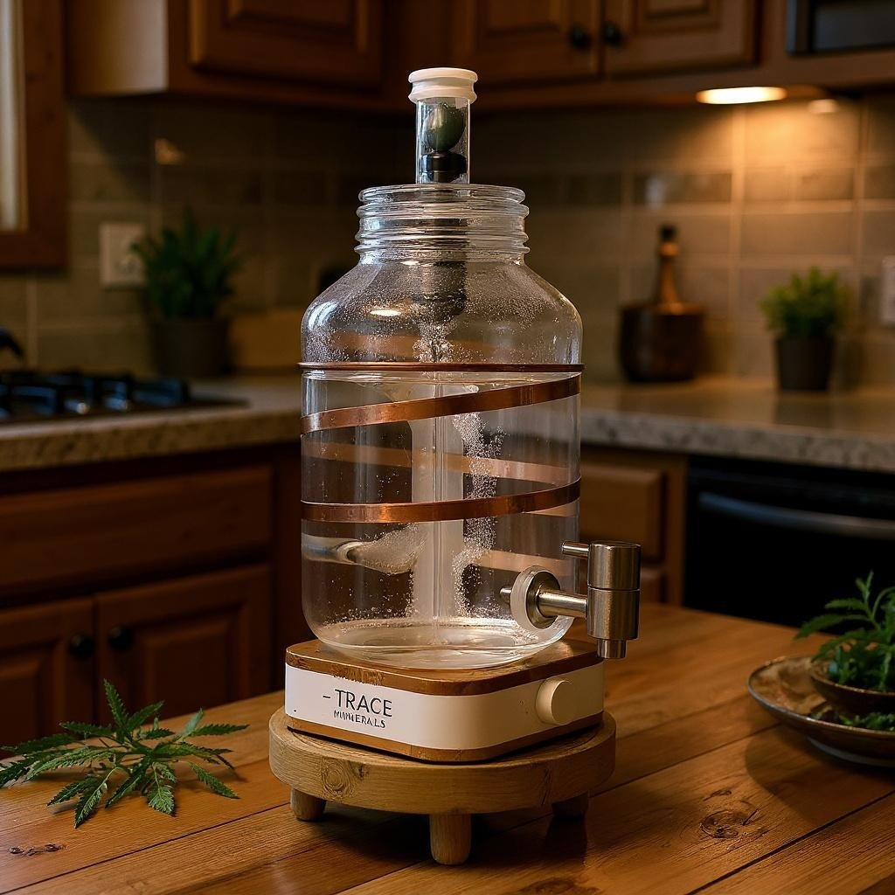

# נחושת ותכונותיה

## **מבט היסטורי וחומרי**

נחושת היא אחת המתכות העתיקות ביותר שבני האדם השתמשו בה - החל ממטבעות ותכשיטים ועד לתכנון מתקנים טכנולוגיים. חשוב להבין את תכונותיה הייחודיות כדי להעריך את תפקידיה האמיתיים בגוף ובטכנולוגיה.

## **תכונות פיזיות וכימיות**

נחושת היא מתכת אדמדמה בעלת יכולת מוליכות חום וחשמל מצוינת, מה שהופך אותה לבחירה נפוצה לכבלי חשמל ולמערכות קירור. עם חשיפה לאוויר ולחות, היא מפתחת פטינה ירקרקה - שכבת קורוזיה שמגנה על פני השטח מפני המשך שחיקה.

## **תפקיד ביולוגי בגוף האדם**

נחושת חיונית כי היא משמשת כקו־פקטור לאנזימים חיוניים במטבוליזם, יצירת אנרגיה, חמצון ברזל, ייצור קולגן ועוד. אחד מהאנזימים המרכזיים הוא סופר־אוקסיד דיסמוטאז, שנלחם בחמצון ונמצא בקרום התא. מקורות רבים מאששים את חשיבותה לביוכימיה חיונית  
([pmc.ncbi.nlm.nih.gov](https://pmc.ncbi.nlm.nih.gov/), [ods.od.nih.gov](https://ods.od.nih.gov/), [frontiersin.org](https://www.frontiersin.org/)).

כמו כן, מחקרים מצביעים על כך שנחושת חיונית לסינתזה של חלבון ה־ceruloplasmin, שתפקידו לשאת אותה בזרם הדם ולסייע במטבוליזם של ברזל  
([en.wikipedia.org](https://en.wikipedia.org/), [ods.od.nih.gov](https://ods.od.nih.gov/)).

## **מקורות תזונתיים טבעיים**

לקבלת נחושת, כדאי לפנות למזונות טבעיים כמו אגוזים, זרעים, קקאו, קטניות ודגנים מלאים. בעזרת תזונה מאוזנת, הגוף מקבל כמות מספקת של כ־0.9 מ"ג ליום, ואין צורך בתוספת מלאכותית

([health.com](https://www.health.com), [verywellhealth.com](https://www.verywellhealth.com)).

עם זאת, ישנם חוקרים הטוענים כי עקב דלדול מינרלים בקרקעות מודרניות, חלק מהמזונות עשויים להכיל פחות נחושת מאשר בעבר. המשמעות היא שכדאי לשים לב למקורות מגוונים של נחושת בתפריט, במיוחד כאשר התזונה מבוססת על מזון מתועש או דל באגוזים, זרעים וקטניות.

------------------------------------------------------------------------

# **תכונות אנטי־בקטריאליות**

## **מחקר חיצוני ומדעי**

נחושת ותרכובותיה (כמו messing ו־bronze) נחשבות חומרי אנטי־מיקרוביאליים טבעיים. מחקרים רבים מצביעים על כך שמשטחים מנחושת הורגים מיקרואורגניזמים במהירות - תופעה המכונה “contact killing”  
([pmc.ncbi.nlm.nih.gov](https://pmc.ncbi.nlm.nih.gov/), [journals.asm.org](https://journals.asm.org/), [en.wikipedia.org](https://en.wikipedia.org/)).

ה־EPA בארה״ב אף אישר שימוש בחומרים אלו בסביבה רפואית, עם ראיות לכך שהחלפת משטחים רגילים בנחושת הובילה לירידה משמעותית בזיהומים. בחדרי טיפול נמרץ נמדדה ירידה של כ־40% בזיהומים לאחר שימוש במשטחי נחושת  
([en.wikipedia.org](https://en.wikipedia.org/), [copper.org](https://copper.org/)).

## **ההבדל בין חוץ לפנים**

כאן חשוב להבחין: יש פער גדול בין פעולה אנטי־מיקרוביאלית חיצונית לבין השפעה פנימית בגוף. מערכת העיכול מכילה מיקרוביום עדין ועשיר בחיידקים טובים. חשיפה עודפת לנחושת יכולה להפר איזון זה ולפגוע גם באוכלוסיות מועילות. במילים אחרות - מה שעובד יפה על משטח חיצוני, לא בהכרח מתורגם לבריאות פנימית.

------------------------------------------------------------------------

# **עודף נחושת והשפעותיו**

## **סימני עודף חריף**

במינונים גבוהים יחסית (כמה מיליגרמים בודדים מעל המינון המומלץ), נחושת עלולה לגרום לתסמינים במערכת העיכול:

- בחילה  
- כאבי בטן  
- הקאות  
- שלשולים  

השפעות חריפות אלו מתועדות היטב בספרות הרפואית ומוגדרות כ־Copper Toxicity  
([NIH ODS](https://ods.od.nih.gov/)).

## **עודף כרוני ומצטבר**

בחשיפה ממושכת, גם אם המינון נמוך, הנחושת נוטה להצטבר בעיקר בכבד ובמוח. עודף כרוני עלול להוביל לבעיות נוירולוגיות, נזק כבדי ואף למחלות נדירות כמו מחלת וילסון, שבה קיימת פגיעה במנגנון פינוי נחושת מהגוף  
([pmc.ncbi.nlm.nih.gov](https://pmc.ncbi.nlm.nih.gov/)).

במערכת העיכול, עודף מתמשך עלול לגרום לדלקתיות ולפגיעה בריריות. מחקרים עדכניים מצביעים גם על קשר בין חשיפה לנחושת לבין פגיעה במיקרוביום - ירידה במגוון החיידקים הטובים ועלייה בחיידקים פתוגניים  
([pubmed.ncbi.nlm.nih.gov](https://pubmed.ncbi.nlm.nih.gov/)).

## **חשיפה דרך מים וצנרת**

צנרת נחושת עלולה להעלות את ריכוז הנחושת במים, במיוחד כשהמים עומדים זמן רב בצינור. במדינות רבות נרשמו תלונות על טעם מתכתי ותחושת בחילה. ההמלצה היא לפתוח את הברז ולהזרים מים לפני שתייה. בארה"ב נמצא שמים עומדים בצנרת נחושת עלולים להגיע לרמות מעל 1 מ"ג/ליטר - רמה שכבר עשויה לגרום לתסמיני מערכת עיכול באוכלוסיות רגישות  
([EPA](https://deq.utah.gov/drinking-water/about-lead-and-copper)).

------------------------------------------------------------------------

# **אחסון מים בכלי נחושת**

## **זמן בטוח מול זמן מסוכן**

 במסורות עתיקות, בעיקר באיורוודה ההודית, מקובל לשתות "תמרה ג'אל" - מים שעמדו לילה בכלי נחושת. המחקר המודרני מראה שמים כאלה אכן מכילים יוני נחושת בריכוז נמוך ושיש בהם ירידה בחיידקים פתוגניים. ייתכן ששיטה זו שימשה לא רק כטקס רוחני אלא גם כאמצעי סניטציה חיוני בתקופה שבה לא היו שיטות אחרות לטיהור מים. עם זאת, גם כאן הגבול בין מועיל למסוכן תלוי בזמן האחסון ובתנאים.

- **עד 8 שעות** - ריכוז נמוך, אפקט אנטי־בקטריאלי, בטוח ברוב האוכלוסיות  
  ([PMC3312355](https://pmc.ncbi.nlm.nih.gov/articles/PMC3312355)).  
- **עד 24 שעות** - הריכוז עולה לכיוון מיליגרם לליטר. עדיין מתחת לגבול WHO ו־EPA (2 מ"ג/ליטר), אך כבר עלול לגרום לטעם מתכתי או אי־נוחות בבטן אצל רגישים  
  ([WHO](https://www.ncbi.nlm.nih.gov/books/NBK225402)).  
- **48 שעות ומעלה** - סכנה ממשית להרעלה קלה או כרונית, במיוחד במים חומציים או רכים. תועדו מקרים של הקאות ושלשולים.  

## **תנאים משפיעים**

- **pH** - מים חומציים מגבירים קורוזיה של נחושת.  
- **ריכוז מלחים** - מים רכים משחררים יותר יונים.  
- **טמפרטורה** - חום מזרז שחרור מתכת.  
- **שטח פנים** - כלי גדול עם שטח פנים רחב מגדיל המסת יונים.  

------------------------------------------------------------------------

# **עדויות מהשטח והפער מול התקנים**

למרות שהתקנים מגדירים גבול בטיחות של כ־2 מ"ג/ליטר, הניסיון המעשי חשף כי גם רמות נמוכות בהרבה עלולות ליצור בעיות:

- **טעם מתכתי** - לקוחות שתו מים שעברו בצנרת נחושת ודיווחו על טעם דוחה. חוש הטעם משמש מנגנון הגנה שמתריע על מתכות חופשיות.  
- **רגישות במערכת העיכול** - חלק מהמשתמשים חוו אי־נוחות עיכולית לאחר שימוש רציף. עם הסרת צנרת הנחושת, התופעות נעלמו.  

מכאן ברור שהתקנים מתמקדים בעיקר במניעת הרעלה חריפה, אך אינם משקפים השפעות עדינות יותר כמו פגיעה במיקרוביום או רגישות מצטברת.

------------------------------------------------------------------------

### **✦ בדיקה עצמית טבעית למצב נחושת בגוף**

מעבר לבדיקות מעבדה, קיימת גם אפשרות של **בדיקה עצמית טבעית** דרך הקשבה לאותות הגוף:

- **עודף נחושת** עשוי להתבטא בטעם מתכתי בפה, בחילה אחרי שתייה מכלי מתכת, רגישות בקיבה או חוסר נוחות עיכולית מתמשכת.  
- **חוסר בנחושת** עשוי להופיע כעייפות, עור חיוור, שיער חלש ושברירי או נטייה לזיהומים חוזרים.  

אלו אינם סימנים חד־משמעיים, אך הם יכולים לשמש כ"מדד ביולוגי אינטואיטיבי": הגוף עצמו מאותת דרך חוש הטעם, מערכת העיכול ומראה החוץ.

שילוב של הקשבה פנימית עם מודעות תזונתית מאפשר הערכה טבעית ראשונית למצב הנחושת – עוד לפני פנייה לבדיקות רשמיות.

------------------------------------------------------------------------

# **✦ פרק מסכם - נקודת המפגש עם הנחושת**

כאן אני עובר מהמבט המדעי אל המבט התודעתי.  
נחושת מזמינה אותי להביט בה כמו באש: יסוד חיוני, מלא כוח, אך כזה שהמפגש איתו דורש גבולות ברורים. ראיתי שוב ושוב - בעוד שמינונים גבוהים יוצרים עומס במערכת העיכול ובכבד, הרי שמגע עדין, נקודתי, יכול דווקא לאזן ולהאיר.

לכן ההמלצה שלי פשוטה: לא להפוך כלי נחושת לכלי שתייה יומיומי, אלא לבחור בטקס קטן ומדויק - כוס אחת ביום, מים שעמדו לילה בכוס נחושת. כך ניתן לגעת בתכונה האנטי־בקטריאלית של היסוד הזה בלי להפוך אותה לעומס.

- [Healthline - Copper Toxicity  
  ](https://www.healthline.com/health/copper-toxicity)
- [Times of India - Drinking from Copper Vessels  
  ](https://timesofindia.indiatimes.com/life-style/food-news/5-things-to-know-before-drinking-water-in-a-copper-bottle/photostory/122854708.cms)

אבל עבורי זה לא הסתכם כאן. כשפיתחתי את מערכת **ימה**, רציתי לשמר את תכונת הנחושת - אך בלי להפוך אותה לסיכון יומיומי. הפתרון היה יצירתי: קטע מגע קצר של סנטימטר אחד בלבד, שבו המים חולפים ונוגעים בנחושת. זהו מגע מזכיר, לא עומס. איזון קבוע שמכניס את יסוד הנחושת כחלק מסימפוניה גדולה יותר, מבלי לשנות את הרכב המים לרמות מסוכנות.

בכך נפתר האתגר: הנחושת נשארת נוכחת, אך לא משתלטת. היא מתפקדת כסמל איזון בתוך המערכת, לא כמשקה יומיומי.

------------------------------------------------------------------------

## מערכת ימה

<figure class="wp-block-image size-full">

</figure>

# **טבלה מסכמת**

<figure class="wp-block-table">
<table class="has-fixed-layout">
<tbody>
<tr class="odd">
<td><strong>תחום</strong></td>
<td><strong>יתרונות</strong></td>
<td><strong>סיכונים</strong></td>
</tr>
<tr class="even">
<td>שימוש חיצוני (משטחים)</td>
<td>אנטי־בקטריאלי חזק, ירידה בזיהומים</td>
<td>אין סיכון פנימי</td>
</tr>
<tr class="odd">
<td>שימוש פנימי (שתייה יומיומית)</td>
<td>תוספת מינרל, פוטנציאל אנטי־בקטריאלי נקודתי</td>
<td>בחילות, הקאות, פגיעה במיקרוביום, נזק מצטבר</td>
</tr>
<tr class="even">
<td>שתייה נקודתית (כוס אחת ביום)</td>
<td>אפקט אנטי־בקטריאלי עדין, טקס תומך</td>
<td>סיכון נמוך כל עוד לא מצטבר</td>
</tr>
<tr class="odd">
<td>מערכת ימה</td>
<td>מגע מבוקר של 1 ס"מ בלבד, איזון קבוע</td>
<td>מונע עומס או עודף</td>
</tr>
</tbody>
</table>
</figure>

------------------------------------------------------------------------
