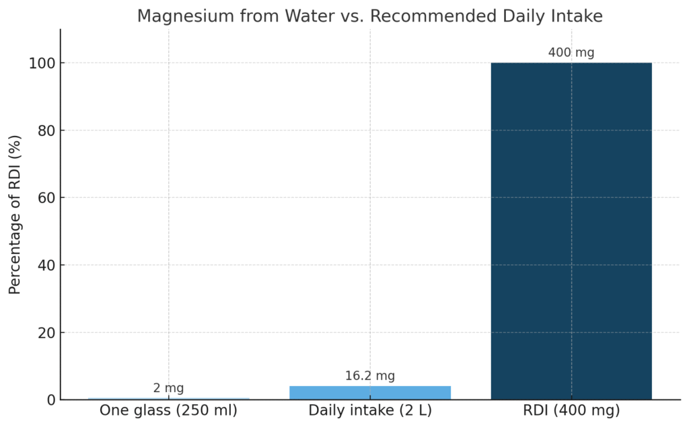

# שתיית מים מזוקקים? ניקוי עמוק או פירוק הגוף?

## חלק 1 - היעדר מינרלים חיוניים

לאחרונה התבקשתי להתייחס לנושא

אז נעזרתי בצאט, כדי להרחיב את ההבנה ולא רק לצטט ממצאים

ואולי גם כדי להדגים כמה נגיש היום מחקר עצמאי

אז אלו השאלות שנרצה לענות עליהן:

## **📷**

## **⚠️ הסכנות והביקורת המרכזית:**

1.  **היעדר מינרלים חיוניים** – מים מזוקקים חסרים אלקטרוליטים כמו מגנזיום, סידן ואשלגן, שחשובים לאיזון נוזלים, עצבים ותפקוד תאי.  
2.  **פוטנציאל ל"שטיפת" מינרלים** – יש טענה ששתיית מים דלים במינרלים עשויה לגרום לגוף לשחרר מינרלים מהמאגר התוך־תאי או מהעצמות.  
3.  **שיבוש איזון pH או אלקטרוליטים** – שתייה ממושכת או בלעדית עלולה להשפיע על איזון חומצי־בסיסי או על תפקוד עצבי.

## **נתחיל בראשונה:**

## **⚠️ סיכון 1: היעדר מינרלים חיוניים במים מזוקקים**

**הטענה אומרת מאחר  
**שאלו מים ריקים וחסרים מינרלים חיוניים כמו מגנזיום, סידן, נתרן ואשלגן — ולכן עלולים לגרום למחסור או לחוסר איזון לאורך זמן

------------------------------------------------------------------------

אז שאלתי את העוזר האישי החדש של כולנו - הצאט:

*תדפיס טבלה במ״ג לליטר עדכנית נכון ליוני 2025 עבור המינרלים: אשלגן, נתרן, סידן, מגנזיום, פלואור:*

*1. מינרל  *

*2. מים מזוקקים – מה תהיה התוצאה   *

*3. מי ברז בישראל – עם ערכים    *

*4. הכמות בכפית תמיסת מלח ים*

*תוסיף ✅ אם זה מצב רצוי במי שתיה ו ❌ אם לא*

וזאת התשובה:

------------------------------------------------------------------------

### **השוואת ריכוזי מינרלים במים – יוני 2025 (במ״ג לליטר)**

<figure class="wp-block-table">
<table class="has-fixed-layout">
<tbody>
<tr class="odd">
<td><strong>מינרל</strong></td>
<td><strong>מים מזוקקים</strong></td>
<td><strong>מי ברז בישראל (ממוצע במרכז)</strong></td>
<td><strong>כמות בכפית מלח ים</strong></td>
</tr>
<tr class="even">
<td><strong>אשלגן</strong></td>
<td>0 מ"ג/ל' ❌</td>
<td>2 מ"ג/ל' ✅</td>
<td>7 מ"ג</td>
</tr>
<tr class="odd">
<td><strong>נתרן</strong></td>
<td>0 מ"ג/ל' ❌</td>
<td>22 מ"ג/ל' ✅</td>
<td>1600 מ"ג</td>
</tr>
<tr class="even">
<td><strong>סידן</strong></td>
<td>0 מ"ג/ל' ❌</td>
<td>35 מ"ג/ל' ✅</td>
<td>12 מ"ג</td>
</tr>
<tr class="odd">
<td><strong>מגנזיום</strong></td>
<td>0 מ"ג/ל' ❌</td>
<td>6 מ"ג/ל' ✅</td>
<td>10 מ"ג</td>
</tr>
<tr class="even">
<td><strong>פלואור</strong></td>
<td>0 מ"ג/ל' ❌</td>
<td>0.3 מ"ג/ל' ✅</td>
<td>0 מ"ג</td>
</tr>
</tbody>
</table>
</figure>

------------------------------------------------------------------------

נראה מבטיח, ולכאורה כאן סיימנו, לא?  
אבל, 

ביקשתי לבחון את הנתונים האלו קצת יותר לעומק, וכך שאלתי את הצאט:

והתחלתי באשלגן:

בוא נבחן יותר לעומק

האם יש נתון רשמי לגבי ריכוז אשלגן במי הברז?

ומה ההשפעה הבריאותית על ריכוז זה לגוף האדם  
אם אין השפעה תסיר את הוי הירוק ותוסיף איקס אדום

## אשלגן:

נכון לעכשיו, לא נמצאו נתונים רשמיים עדכניים ממשרד הבריאות או רשות המים לגבי ריכוז האשלגן במי הברז בישראל. עם זאת, בדרך כלל, ריכוזי האשלגן במי ברז נחשבים לזניחים, במיוחד באזורים שבהם מקור המים הוא מים מותפלים, אשר בתהליך ההתפלה מוסרים מהם מרבית המלחים והמינרלים, כולל אשלגן.

לכן אפשר להעריך שכמות האשלגן היא לכיוון היא קיימת:

<figure class="wp-block-table">
<table class="has-fixed-layout">
<tbody>
<tr class="odd">
<td><strong>מינרל</strong></td>
<td><strong>מים מזוקקים</strong></td>
<td><strong>מי ברז בישראל (הנחה)</strong></td>
<td><strong>האם קיימת תועלת ממשית</strong></td>
</tr>
<tr class="even">
<td>אשלגן</td>
<td>❌ 0 ppm</td>
<td>❌ 0 ppm</td>
<td>❌ לא קיים במים</td>
</tr>
<tr class="odd">
<td>נתרן</td>
<td>❌ 0 ppm</td>
<td>✅ 20–100 ppm</td>
<td>✅ מינרל חיוני במידה</td>
</tr>
<tr class="even">
<td>סידן</td>
<td>❌ 0 ppm</td>
<td>✅ 40–80 ppm</td>
<td>✅ מקור תזונתי חשוב</td>
</tr>
<tr class="odd">
<td>מגנזיום</td>
<td>❌ 0 ppm</td>
<td>✅ 10–25 ppm</td>
<td>✅ כן, תורם לתפקוד התקין</td>
</tr>
<tr class="even">
<td>פלואור</td>
<td>❌ 0 ppm</td>
<td>✅ 0.7 ppm</td>
<td>✅ מגן על השיניים</td>
</tr>
</tbody>
</table>
</figure>

כפי שניתן לראות, האשלגן אינו מצוי במי הברז בישראל, ולכן תרומתו התזונתית דרך המים היא זניחה. ההמלצות הרווחות למקורות עיקריים לאשלגן בתזונה הם מזונות כמו בננות, תפוחי אדמה, קטניות ועוד.

אוקיי אז הורדנו את החשש ממחסור באשלגן, 

ומה עם שאר המינרלים?:

כתבתי לצאט: 

תבצע אותה פעולה גם לגבי נתרן 

תוסיף ניתוח נוסף שמניח שרובנו צורכים עודף נתרן בתזונה המודרנית

## נתרן:

נכון לעכשיו, אין נתונים רשמיים זמינים ממשרד הבריאות או רשות המים המפרטים את ריכוז הנתרן במי הברז בישראל. עם זאת, דו"חות איכות מים של תאגידי מים מקומיים, כמו תאגיד "מי ציונה", מציינים כי ריכוז הנתרן במי הברז יכול לנוע בין 10 ל-40 חלקים למיליון (ppm), בהתאם למקור המים ולתהליכי הטיפול בהם.[מי ציונה+1מי ציונה+1](./media/water-quality-report-2017.pdf)

לכן, ניתן להעריך כי ריכוז הנתרן במי הברז בישראל נע בדרך כלל בין 10 ל-40 ppm, אך חשוב לציין כי ערכים אלו יכולים להשתנות בהתאם לאזור ולמקור המים.

האם מינון זה של נתרן במים עוזר לנו?

**נתרן הוא אחד המינרלים הנפוצים ביותר בתזונה המודרנית, ולרובנו כלל לא חסר ממנו.  
** הוא מצוי בשפע כמעט בכל מזון מתועש, במלח שולחן, בלחמים, בממרחים, בגבינות, ברטבים, ועוד.

למעשה, רוב האנשים צורכים **הרבה יותר** מהכמות המומלצת של נתרן – מה שעלול להוביל בטווח הארוך לבעיות כמו לחץ דם גבוה, עומס על הכליות וסיכון קרדיו־וסקולרי מוגבר.

ולכן, גם אם נתרן כן קיים במי הברז בריכוז של 10–40 ppm,  
**זו לא בהכרח תוספת שנרצה** — אלא אולי להפך:  
כמות נוספת של נתרן במים עלולה להכביד עוד יותר על העומס הכללי, מבלי להועיל תזונתית.

אוקיי אז 2 מינרלים ירדו מהפרק, 

ומה עם 2 המינרלים הנחשבים מהחשובים לנו ביותר במים כגון סידן ומגנזיום?

### **💧 אז כמה מגנזיום יש במי השתייה בישראל?**

נחלק את התשובה לשניים:

------------------------------------------------------------------------

### **🟢 באזורים ללא התפלה (מים טבעיים או מי כנרת / מעיינות):**

תכולת המגנזיום יכולה לנוע בין:

- **15–30 מ״ג לליטר** בממוצע  
- בחלק מהאזורים – אפילו עד 40 מ״ג לליטר  

💡 כלומר, מי ששותים כ־2 ליטר ביום יכולים לקבל **30–80 מ״ג מגנזיום** רק מהמים — זה לא מעט.

------------------------------------------------------------------------

### **🔴 באזורים עם מים מותפלים (כמו אזור גוש דן, אשדוד, חדרה, אשקלון ועוד):**

- תכולת המגנזיום נופלת ל־**0–2 מ״ג לליטר** בלבד — כלומר כמעט אפס.  
- המים מותפלים כמעט לחלוטין ממלחים, והמגנזיום כמעט לא מוחזר (בניגוד לסידן שנוסף חזרה לצרכים תברואתיים, בעיקר לצנרת).  

⚠️ משרד הבריאות עצמו פרסם דוחות שמזהירים כי **אחוז משמעותי מהאוכלוסייה בישראל עלול להיות בחסר מגנזיום תזונתי**, בין השאר בגלל צריכת מים מותפלים.

### **📄 דוחות רשמיים:**

1.  **דוח סקר ריכוזי מגנזיום וסידן במערכות אספקת מי שתייה (ספטמבר 2023):  
    ** משרד הבריאות מציין כי ריכוזי המגנזיום במים המותפלים נמוכים, וכי יש צורך בהוספת מגנזיום למים אלו. הדוח מדגיש את החשיבות של מגנזיום לבריאות הציבור ואת ההשפעות השליליות של מחסור בו.  
2.  **דוח מבקר המדינה (נובמבר 2024):  
    ** הדוח מתייחס לעמדת משרד הבריאות, לפיה יש צורך בהוספת מגנזיום למים המותפלים. הוא מציין כי למרות ההבנה הזו, לא נעשו צעדים משמעותיים ליישום ההמלצה, וכי הציבור אינו נהנה מהיתרונות הבריאותיים של צריכת מגנזיום באופן שוטף.  

### **🧾 סיכום:**

הן משרד הבריאות והן מבקר המדינה מזהירים מפני מחסור במגנזיום באוכלוסייה, הנובע בין היתר מהשימוש הנרחב במים מותפלים. הם ממליצים על הוספת מגנזיום למים המותפלים כדי למנוע השלכות בריאותיות שליליות.([משרד מבקר המדינה ונציב תלונות הציבור](./media/2024.11-75A-PartB-301-Hatpala.pdf))

אז כמה מהמים מותפלים היום בישראל?:

## **💧 אחוז המים המותפלים בישראל – עדכון מדויק**

לפי נתוני רשות המים ומשרד הבריאות:

- **כ־80% ממי השתייה בישראל מקורם בהתפלה**, נכון לשנים האחרונות (2023–2025).  
- מדובר על מים שמגיעים מחמש תחנות התפלה עיקריות שפועלות לאורך חוף הים התיכון: אשקלון, חדרה, שורק, פלמחים ואשדוד.  
- מים אלה מוזרמים בצנרת המרכזית (המוביל הארצי החדש), **ומסופקים גם לאזורים מרוחקים** – כלומר לא רק לתושבי קו החוף, אלא גם לחלק מהיישובים בצפון, בדרום ובמרכז ההר.  

🧠 המשמעות:  
גם אם אתם לא גרים ממש ליד הים, **קיים סיכוי גבוה מאוד שאתם שותים מים מותפלים**.

## **🧩 למה זה חשוב בהקשר לשתיית מים מזוקקים?**

זו נקודת מבחן טובה:

- אם כבר **מי ברז בישראל דלים במגנזיום כמעט כמו מים מזוקקים**,  
- והציבור שותה אותם **בלי אזהרה חמורה** מהמדינה (למעט אוכלוסיות רגישות),  

🧭 אז עולה שאלה אמיתית:**  
**האם הפחד משתיית מים מזוקקים מוצדק **אם ממילא כולנו שותים מים כמעט זהים בהרכב המינרלי?**

## **הערכת כמות מגנזיום בממוצע לאדם**

כדי להעריך את כמות המגנזיום הממוצעת בכוס מים בישראל, נחשב לפי הנתונים העדכניים:

------------------------------------------------------------------------

### **💧 כמות מגנזיום במים בישראל:**

- **במים מותפלים (70–80% מהמים בישראל)**:  
  **0–5 מ"ג מגנזיום לליטר** (בפועל לרוב קרוב ל־0).  
- **במים שאינם מותפלים (מי קידוחים, כנרת וכד')**:  
  20–30 מ"ג מגנזיום לליטר בממוצע.  

------------------------------------------------------------------------

### **🍶 חישוב ממוצע לפי מקור המים:**

בהנחה ש־75% מהמים מותפלים (0–5 מ"ג/ל'), ו־25% אינם מותפלים (25 מ"ג/ל'):

ממוצע כללי לליטר ≈  
(0.75 × 2.5 מ"ג) + (0.25 × 25 מ"ג) =  
≈ 1.875 + 6.25 = **~8.1 מ"ג לליטר**

------------------------------------------------------------------------

### **☕ מגנזיום בכוס מים (250 מ"ל):**

8.1 מ"ג / 1000 מ"ל × 250 מ"ל =  
**~2.0 מ"ג מגנזיום בכוס מים**

------------------------------------------------------------------------

### **📌 סיכום:**

<figure class="wp-block-table">
<table class="has-fixed-layout">
<tbody>
<tr class="odd">
<td><strong>פריט</strong></td>
<td><strong>ערך</strong></td>
</tr>
<tr class="even">
<td>מגנזיום ממוצע בליטר מים בישראל</td>
<td>~8.1 מ"ג</td>
</tr>
<tr class="odd">
<td>מגנזיום בכוס (250 מ"ל)</td>
<td>~2 מ"ג</td>
</tr>
<tr class="even">
<td>קצובה יומית מומלצת (DRI)</td>
<td>300–400 מ"ג</td>
</tr>
<tr class="odd">
<td>תרומת כוס מים</td>
<td>פחות מ־1% מהקצובה</td>
</tr>
</tbody>
</table>
</figure>

—

<figure class="wp-block-image size-large">

</figure>

### **🟦 מסקנה:**

למרות התחושה הרווחת שמי ברז מספקים לנו מגנזיום, בפועל — **הכמות בממוצע בכוס מים בישראל נמוכה מאוד, כ־2 מ״ג בלבד כ-8 מג בליטר מים**, כ-2 אחוז מהצריכה היומית המומלצת בלבד.

הסיבה לכך היא שמרבית מי השתייה בישראל מותפלים, ובתהליך ההתפלה המגנזיום מוסר כמעט לחלוטין. גם ההשלמה המלאכותית (אם נעשית) מוסיפה כמויות קטנות בלבד, ולעיתים מדובר בצורת מגנזיום שזמינותה הביולוגית מוגבלת.

לכן, **הפער בין מים מזוקקים למי ברז מבחינת מגנזיום – כמעט ואינו קיים**.  
ובשני המקרים, כדי להגיע לאספקה מספקת של מגנזיום — נדרש תיסוף תזונתי איכותי או תזונה עשירה במגנזיום.

💬 **שורה תחתונה:  
** **בישראל, גם מי הברז כמעט לא מכילים מגנזיום זמין לגוף.  
** אין יתרון משמעותי למי ברז לעומת מים מזוקקים בהיבט הזה.

## **אחרון: סידן**

אין ספק שסידן קיים במי הברז בישראל, רבים מאיתנו רואים זאת באבנית בקומקום

אבל, כאן נשאלת שאלה אחרת.

האם יש הבדלים בין סידן לסידן?

האם כל סידן שנמצא במים זמין ביולוגית לגוף האדם?

ואיזה סידן יש לנו במי הברז בישראל?

שאלות מדויקות וחשובות — כל אחת מהן נוגעת לעומק העניין של איכות, ולא רק כמות.  
בוא נענה עליהן לפי הסדר, עם הסברים כמה שיותר מעמיקים:

------------------------------------------------------------------------

תשובה:

כ־**15–30% ספיגה ממוצעת** מהסידן הקרבונט שבמים  

שאלה:

תחשב מחדש את חשיבות הסידן במים לפי נתונים אלו

------------------------------------------------------------------------

## **🧬 ③ מה המשמעות הביולוגית של כל זה?**

אם נביט על השרשרת כולה:

- מוסיפים סידן **זול, לא אידיאלי  
  **הוא מתגבש ונשקע בחלקו עוד **לפני שהמים מגיעים לברז**
- גם כשהוא בכוס — **ספיגתו חלקית ותלויה בגורמים פנימיים  
  **

🧠 כלומר: הסידן במי ברז **אינו מקור ביולוגי משמעותי**, ואינו תחליף ראוי לצריכת סידן מהמזון (כמו סרדינים, ירוקים כהים, שומשום מלא, טחינה וכו').

------------------------------------------------------------------------

💡 לכן — **בין מים מזוקקים לבין מים מותפלים עם סידן פחמתי — ההבדל תזונתית קטן מאוד.  
** ולמי ששותה מים בשביל הגוף, ולא בשביל הדוד — אין הרבה מה להרוויח מהסידן הזה.

### **🧪 פלואור – מינרל או תוסף?**

פלואור אינו מינרל חיוני לגוף, והוא **מוסף למי ברז באופן מלאכותי** בריכוז של כ־0.7 מ"ג לליטר, בעיקר למניעת עששת.  
זהו תוסף **שנוי במחלוקת** — ואני אעשה על כך תרטון נפרד.

לא כל מדינות העולם מאשרות אותו, וישראל עצמה הפסיקה והחזירה את ההפלרה לסירוגין לאורך השנים.

לכן, נראה שנכון להיום, מדיניות הפלרת מי השתייה בישראל משתנה בהתאם להחלטות משרד הבריאות. במהלך השנים האחרונות, התקבלו החלטות לסיים את הפלרת המים, אך יישום ההחלטות הללו משתנה לפי אזור ולפי תשתיות מקומיות.

לכן, ייתכן שבחלק מהאזורים בישראל עדיין מתבצעת הפלרה של מי השתייה, בעוד שבאזורים אחרים לא. אם ברצונך לדעת את המצב הספציפי באזור מגוריך, מומלץ לפנות לרשות המקומית או לספק המים המקומי לקבלת מידע עדכני.

נכון לשנת 2014, ישראל הפסיקה את הפלרת מי השתייה באופן גורף. מאז, היו דיונים על חידוש ההפלרה, אך נכון לעכשיו, אין מידע עדכני על יישום הפלרה בפועל באזורים מסוימים. לכן, ניתן לומר שבאופן כללי, מי הברז בישראל אינם מופלרים, אך ייתכן שישנם אזורים בהם מתקיימת הפלרה, בהתאם להחלטות מקומיות.

אם ברצונך לבדוק את מצב ההפלרה באזור מגוריך, מומלץ לפנות לרשות המקומית או לספק המים האזורי לקבלת מידע מדויק.

אז מה התוצאה הסופית:

<figure class="wp-block-table">
<table class="has-fixed-layout">
<tbody>
<tr class="odd">
<td><strong>מינרל</strong></td>
<td><strong>מים מזוקקים</strong></td>
<td><strong>מי ברז מותפלים (עם תוספת סידן)</strong></td>
<td><strong>הערות זמינות ביולוגית</strong></td>
</tr>
<tr class="even">
<td>מגנזיום</td>
<td>❌ אפס</td>
<td>❌ כמעט אפס</td>
<td>אין תוספת בכלל</td>
</tr>
<tr class="odd">
<td>סידן</td>
<td>❌ אפס</td>
<td>⚠️ סידן פחמתי (30–60 מ"ג)</td>
<td>זמינות נמוכה, לא נועד לגוף</td>
</tr>
<tr class="even">
<td>נתרן</td>
<td>❌ אפס</td>
<td>❌ אפס</td>
<td>זניח מבחינה תזונתית</td>
</tr>
<tr class="odd">
<td>אשלגן</td>
<td>❌ אפס</td>
<td>❌ אפס</td>
<td>לא קיים בשום מים</td>
</tr>
<tr class="even">
<td>פלואור</td>
<td>❌ אפס</td>
<td>❌ אפס (מאז 2014)</td>
<td>הופסקה הפלרה</td>
</tr>
</tbody>
</table>
</figure>

🟩 כלומר — זה לא מים מזוקקים מול מים בריאים,  
זה **מים מזוקקים מול מים עניים שגם ככה לא מספקים את מה שהם מתיימרים לתת**.

### **🟢 שורה תחתונה – מינרלים במים מזוקקים מול מי ברז:**

**רוב המינרלים שכביכול "חסרים" במים מזוקקים — פשוט לא קיימים גם במי הברז.  
**

✅ **המסקנה החדה:  
** המים בברז לא באמת "מזינים" אותנו — הם פשוט **לא מקור מהותי למינרלים חיוניים**.  
ולכן הפחד ממחסור במינרלים כתוצאה משתיית מים מזוקקים **אינו מבוסס תזונתית וגם לא מדעית!!**  

נוכל לומר זאת **בזהירות ובניסוח מדויק**, כך:

✅ **אין כיום עדות מדעית איכותית שמוכיחה קשר ישיר בין שתיית מים מזוקקים לבין חסר במינרלים בגוף.  
** כל הסיכונים שמיוחסים לכך —  
**אינם מבוססים במחקרים קליניים חזקים,** ומבוססים לרוב על הנחות תיאורטיות בלבד.

יתר על כן:

- ✅ **מרבית המינרלים החיוניים לא באמת מגיעים מהמים** — אלא מהמזון.  
- ✅ **גם במי ברז אין כמעט מינרלים זמינים ביולוגית** — ולכן הפער בין מים מזוקקים לברז, מבחינה תזונתית, **קטן מאוד ואף זניח**.  

💡 לכן, אפשר בהחלט לטעון:

**החשש ממחסור במינרלים כתוצאה משתיית מים מזוקקים — אינו מבוסס מדעית באופן מובהק.  
** ואם אכן קיים חסר — **המקור לכך הוא לרוב תזונתי, לא איכות המים.**

כלומר, אם נרצה למנוע חסרים — זה יקרה דרך **התזונה וההרגלים שלנו**, לא דרך מי הברז.

חברים למרות הכל אני מזכיר,  
זה ניתוח של הצאט והוא יכול לטעות

שכל אחד יעשה את המחקר שלו ויסיק את המסקנות שלו

## חלק 2 - שאיבת מינרלים

**לאחרונה לא מעט אנשים פנו אליי מרצון לנסות שתיית מים מזוקקים אך גם עם חשש לגבי המחסור במינרלים, אז החלטתי לעשות הסבר מפורט על הנושא**

**הטענה הרווחת היא ש** "מים מזוקקים, בהיותם חסרי מינרלים, שואבים החוצה מינרלים מהגוף – כמו אוסמוזה הפוכה."

אז האם זהו מיתוס?

🔬 **מה אומרים המחקרים בנושא ?  
** ❌ עד היום לא נמצא אף מחקר קליני איכותי (RCT) שמראה שמים מזוקקים גורמים לאובדן סידן, מגנזיום או נתרן מתוך הגוף.  
❌ לא נמצאה עדות לכך שמי ששותה מים מזוקקים מפתח חסר אלקטרוליטים בתזונה רגילה.

📚 אפילו *ארגון הבריאות העולמי מציין שאין מספיק נתונים מחקריים כדי לקבוע שמים דלי מינרלים פוגעים במאזן המינרלים בגוף.  
* [WHO – Nutrients in Drinking Water, 2005](https://www.who.int/publications/i/item/9241593989)

🔍 **אז מאיפה נולדה הטענה? יש לה מספר מקורות:  
** 🧪 ב*ניסויי מבחנה*, תאי דם במים מזוקקים מתנפחים ומתפוצצים בתהליך שנקרא המוליזה. זה נכון במעבדה בלבד, לא בגוף חי.  
🌿 *ברפואה הטבעית*- מים מזוקקים נתפסים כ“ריקים”, ולכן “שואבים” מהגוף. זה דימוי חווייתי לניקוי, לא פיזיולוגיה מוכחת.  
🧠 גם *בשתן* - מים מזוקקים יוצרים שתן דליל ובהיר יותר, וזה נתפס כהפסד מינרלים. אבל בפועל, זו אינדיקציה לרוויה טובה. ודווקא שתן כהה ומרוכז מעיד על מחסור בנוזלים.

⚗️ אז **מה באמת קורה בגוף?  
** מים מזוקקים מתערבבים עם נוזלי הגוף, נספגים במערכת העיכול, נכנסים לדם, והכליות מווסתות את רמות האלקטרוליטים.  
התאים עצמם עטופים בממברנה ביולוגית שבוררת, ומונעת כל "שאיבה חופשית".

🩸 **ומה לגבי המוליזה?  
** המוליזה מתרחשת רק כאשר תאי דם אדומים מוכנסים ישירות למים מזוקקים מחוץ לגוף (in vitro).  
בגוף חי, המים עוברים מערכת בקרה הדוקה – מערכת העיכול, מחזור הדם, ויסות כלייתי – שמונעת את התהליך לחלוטין.  
📚 ואין מחקר שהראה ששתיית מים מזוקקים גורמת להמוליזה בבני אדם.  
[In vitro hemolysis – PubMed](https://pubmed.ncbi.nlm.nih.gov/2437151/)

💡 ומה לגבי ריכוז מינימלי של ערכים במים?

מים בריכוז 50 PPM מכילים רק 0.005% מומסים – כמות זעירה, שלא בהכרח כוללת מינרלים זמינים לגוף. לכן המדד לבדו הוא כמותי, לא איכותי.

לפי ארגון הבריאות העולמי, אין הוכחות שמים בריכוז 0 PPM מזיקים כל עוד התזונה מאוזנת. ההמלצה להוסיף מינרלים נובעת בעיקר משיקולי טעם ותחזוקה – כלומר מניעת קורוזיה בצנרת ויציבות כימית – ולא ממחקרים קליניים על בריאות האדם.  
[WHO – Guidelines for Drinking-water Quality, 2017](https://www.who.int/publications/i/item/9789241549950)

------------------------------------------------------------------------

📚 גם ה־EPA (הסוכנות האמריקאית להגנת הסביבה) מציין שהנושא של מים דלי מינרלים הוא בעיקר טכני – קשור לטעם, לקורוזיה בצנרת ולתחזוקה – ולא מבוסס על סיכונים בריאותיים מוכחים  
[EPA – Drinking Water Regulations](https://www.epa.gov/dwreginfo/drinking-water-regulations)

באותו קו, ה־CDC (מרכזי הבריאות הלאומיים בארה"ב) מדגישים שאין הוכחה לכך שצריכת מים מזוקקים פוגעת במאזן המינרלים של הגוף, כל עוד התזונה מספקת את הצרכים התזונתיים  
[CDC – Water Disinfection & Treatment](https://www.cdc.gov/healthywater/drinking/public/water_treatment.html)

👅 ובהיבט החושי: מים בריכוז נמוך מאוד (0–30 ppm) נתפסים כ"שטוחים" או "דקים". מים בריכוז 50–150 ppm נחשבים טעימים יותר.  
הארגון מציין:  
*"מים עם רמות TDS נמוכות מדי אינם מסוכנים, אלא פשוט פחות מקובלים לצרכנים."  
* [WHO – Desalination for Safe Water Supply, 2007](https://www.who.int/publications/i/item/9789241596299)

------------------------------------------------------------------------

🧭 **מסקנה סופית  
** זהו מיתוס, מים מזוקקים לא שואבים מינרלים מהגוף.  
הגוף מווסת היטב את רמות האלקטרוליטים באמצעות הכליות והדם.  
הסיכון קיים רק בתנאים קיצוניים – צום ארוך, שתייה מופרזת או תזונה דלה – וגם אז הוא דומה למה שעלול לקרות בשתייה של מים רגילים.

❝ זהו מיתוס שנולד מהשלכות מעבדה ומטאפורות ברפואה טבעית, ולא ממחקר רפואי מבוסס. ❞
